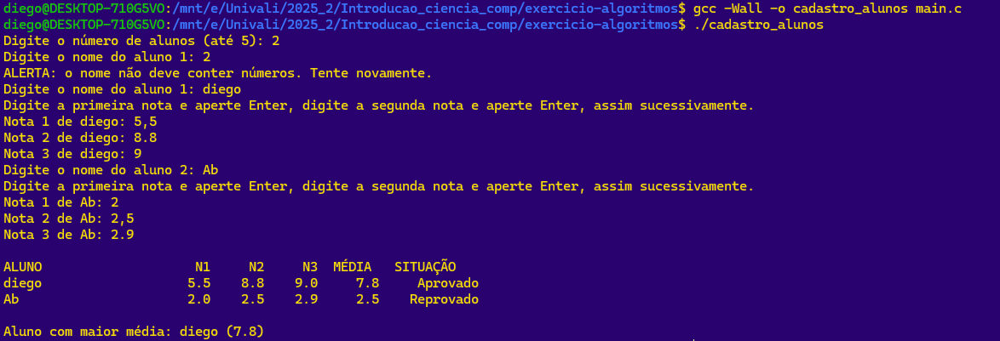

# Cadastro de Alunos em C

Este repositório contém um programa em linguagem **C** para cadastrar até cinco alunos, registrar três notas por aluno, calcular a média, determinar a situação (aprovado/reprovado) e identificar o aluno com maior média. O projeto exercita conceitos de vetores, funções, loops e estruturas condicionais.

## Autores

- **Diego Fonseca**
- **Luís**
- **Miguel**
- **Miruna Onofrei**
- **Pedro Kons**
- **Tiago Mendes**

## Motivação

Em problemas educacionais é comum precisar processar um conjunto de notas e  
extrair informações, como o desempenho médio dos alunos e quem obteve os  
melhores resultados. Desse modo:  
-> O uso de vetores evita a criação de múltiplas variáveis  
para cada entrada e facilita o processamento em laços.  
-> A função dedicada à média encapsula o cálculo e promove reutilização.  
-> A estrutura condicional `if/else` classifica o aluno como **Aprovado**  
quando a média é maior ou igual a 7, caso contrário como **Reprovado**.  
-> A lógica de identificar o aluno com maior média percorre o vetor de  
médias e guarda o índice do maior valor.  

## Pré‑requisitos
- Código-fonte salvo como `main.c`.
- Desejável: conhecimento básico de terminal.

## Como compilar e executar (Ubuntu)

1. Instale o toolchain (GCC, Make e afins):
   ```bash
   sudo apt update
   sudo apt install -y build-essential
   ```
2. Compile e execute:
   ```bash
   gcc -Wall -O2 -o cadastro_alunos main.c
   ./cadastro_alunos
   ```

## Como compilar e executar (Windows via MSYS2 + MinGW‑w64)

1. Baixe e instale o **MSYS2** pelo site oficial.
2. Abra o terminal **MSYS2 UCRT64** (ou **MSYS2 MINGW64**).
3. Atualize os pacotes:
   ```bash
   pacman -Syu
   # Se o terminal pedir para fechar, feche e reabra, então:
   pacman -Su
   ```
4. Instale o GCC do MinGW‑w64 (escolha a variante do seu terminal):
   ```bash
   # Para UCRT64:
   pacman -S --needed mingw-w64-ucrt-x86_64-gcc
   # (Alternativa para MINGW64):
   # pacman -S --needed mingw-w64-x86_64-gcc
   ```
5. No mesmo terminal (UCRT64/MINGW64), compile e execute:
   ```bash
   gcc -Wall -O2 -o cadastro_alunos.exe main.c
   ./cadastro_alunos.exe
   ```

> **Observação:** sempre compile/execute no terminal MinGW do MSYS2 (UCRT64/MINGW64). O `gcc` do ambiente MSYS2 padrão não gera binários nativos de Windows do jeito esperado.

## Exemplo de uso

```
Digite o número de alunos (até 5): 2
Digite o nome do aluno 1: João
Digite a primeira nota e aperte Enter, digite a segunda nota e aperte Enter, assim sucessivamente.
Nota 1 de João: 7,5
Nota 2 de João: 6.0
Nota 3 de João: 8
Digite o nome do aluno 2: Maria
Digite a primeira nota e aperte Enter, digite a segunda nota e aperte Enter, assim sucessivamente.
Nota 1 de Maria: 5
Nota 2 de Maria: 6
Nota 3 de Maria: 5,5

ALUNO                 N1     N2     N3   MÉDIA     SITUAÇÃO
João                  7.5    6.0    8.0     7.2     Aprovado
Maria                 5.0    6.0    5.5     5.5     Reprovado

Aluno com maior média: João (7.2)
```

## Comprovante de funcionamento

Veja a captura de tela da execução em `./funcionando.png`.



## Estrutura do código (resumo)

- **Vetores:** nomes, notas, médias e situações são mantidos em vetores indexados.
- **Função de média:** encapsula o cálculo em `compute_average()`.
- **Validação:** nome sem dígitos; notas aceitam `2.5` **ou** `2,5`.
- **Decisão condicional:** média `>= 7` ⇒ Aprovado; caso contrário ⇒ Reprovado.
- **Maior média:** varredura sequencial para localizar o maior valor.

## Licença

Este projeto está licenciado sob a **MIT License**.

## Referências

- (pt‑BR) Microsoft Learn – *Usando o Mingw‑w64 nativamente no Windows (vcpkg/MSYS2)*.  
  https://learn.microsoft.com/pt-br/vcpkg/users/platforms/mingw
- (pt‑BR) Viva o Linux – *Compilar programas em C no Ubuntu com o gcc* (dica).  
  https://www.vivaolinux.com.br/dica/Compilar-programas-em-C-no-Ubuntu-com-o-gcc
- (en) MSYS2 – *Official website & install steps*.  
  https://www.msys2.org/
- (en) Ubuntu Community Help Wiki – *InstallingCompilers (build‑essential)*.  
  https://help.ubuntu.com/community/InstallingCompilers
